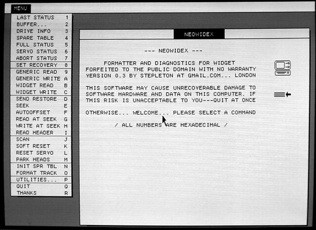

# NeoWidEx

NeoWidEx is a formatting and diagnostic utility for the Widget, a 10-megabyte
hard drive that Apple Computer designed and manufactured the 1980s. It runs on
the Apple Lisa 2/10 computer, the only computer Apple ever sold with a Widget
inside.

## Fair warning

NeoWidEx can easily destroy all of the data on your Widget, quickly and
permanently. It might even harm your Widget itself, even if it is used in a
cautious and sensible way. If you're not prepared to risk these consequences,
don't use NeoWidEx.

## Required reading

NeoWidEx is a powerful tool that issues low-level commands directly to a
Widget. To use NeoWidEx effectively, you need to know how a Widget works and
what these commands do.

The documentation that comes with NeoWidEx will not give you this knowledge on
its own. Get ready to use NeoWidEx by studying the [Widget ERS document](
http://bitsavers.trailing-edge.com/pdf/apple/disk/widget/Widget_ERS.pdf),
particularly PDF pages 81-135.

## System requirements

You can get started right away with NeoWidEx if you have:

- A working floppy drive (or a floppy drive emulator like [Floppy Emu](
  http://www.bigmessowires.com/floppy-emu/)).
- A Lisa 2 with ROM version H.

If you're missing any of these things but wish to use NeoWidEx anyway, refer to
the "System requirements" section in [MANUAL.md](MANUAL.md#system-requirements).

NeoWidEx will run on a Lisa 2/5---that is, a Lisa 2 with a built-in external
parallel port---but it will only be able to access drives attached to that
port. Most NeoWidEx options will be unavailable unless that drive is a Widget.

The [LisaEm](http://lisa.sunder.net) emulator will run NeoWidEx, although
because LisaEm does not emulate a Widget, many options will be unavailable.

## Other notes

NeoWidEx is released into the public domain. Nobody owns NeoWidEx.

NeoWidEx is named after **Widex**, an Apple-internal Widget utility developed
when the disks were new. No copies of this software are readily available today,
but some usage notes have been archived [on Bitsavers](
http://bitsavers.trailing-edge.com/pdf/apple/disk/widget/Widex_May84.pdf).

Other "Widex-like" low-level tools exist. The [Basic Lisa Utility](
http://sigmasevensystems.com/BLU.html) provides many useful functions for
working with Lisa disks, but provides no direct access to Widget-specific
features. [UsbWidEx](http://john.ccac.rwth-aachen.de:8000/patrick/UsbWidEx.htm)
is a hardware peripheral that can do everything that NeoWidEx can and much
more---without the Lisa.

NeoWidEx is written in around 10,000 lines of 68000 macro assembly.

## Acknowledgements

It would not have been possible for me to write NeoWidEx without the following
people and resources:

- [Dr. Patrick Schäfer](http://john.ccac.rwth-aachen.de:8000/patrick/index.htm),  whose numerous contributions include disassembly and/or analysis of various
  Widget ROMs, technical documentation from his various projects, and some
  helpful emails.
- [bitsavers.org](http://bitsavers.org)'s archived technical documentation.
- The [LisaEm](http://lisa.sunder.net) emulator by Ray Arachelian.
- The [Floppy Emu](http://www.bigmessowires.com/floppy-emu/) floppy drive
  emulator.
- The [BLU](http://sigmasevensystems.com/BLU.html) utility by James MacPhail
  and Ray Arachelian.
- The entire [LisaList](https://groups.google.com/forum/#!forum/lisalist)
  community.

-- _[Tom Stepleton](stepleton@gmail.com), 10 April 2017, London_
